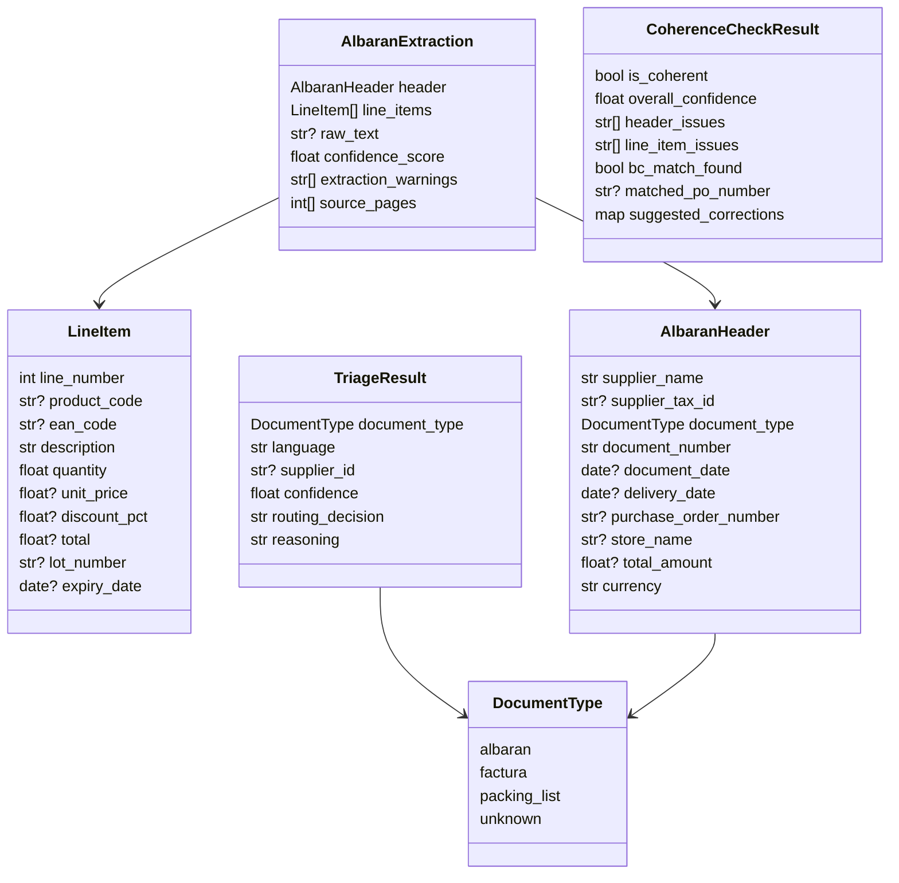

# Core agent data models

## Scope

This document describes the Pydantic models in `src/models/albaran.py` used by the implemented A1-A3 agents.

## Model relationships



## `DocumentType`

Enum values:

- `albaran`
- `factura`
- `packing_list`
- `unknown`

This enum is reused by both triage and extraction.

## `AlbaranHeader`

Represents the business-level header of the document.

| Field | Type | Meaning |
|---|---|---|
| `supplier_name` | `str` | Supplier / proveedor name shown on the document |
| `supplier_tax_id` | `str | None` | Tax identifier (NIF/CIF/VAT) when present |
| `document_type` | `DocumentType` | Business document type classified for the extraction |
| `document_number` | `str` | Supplier document number / número de albarán |
| `document_date` | `date | None` | Document issue date |
| `delivery_date` | `date | None` | Delivery date if separate from issue date |
| `purchase_order_number` | `str | None` | Purchase order / pedido number used for downstream BC validation |
| `store_name` | `str | None` | Store / tienda receiving the delivery |
| `total_amount` | `float | None` | Document grand total when present |
| `currency` | `str` | Currency code, default `EUR` |

### Example JSON

```json
{
  "supplier_name": "Viveros Costa Verde S.L.",
  "supplier_tax_id": "B12345678",
  "document_type": "albaran",
  "document_number": "ALB-2026-00421",
  "document_date": "2026-05-03",
  "delivery_date": "2026-05-04",
  "purchase_order_number": "PO-45001234",
  "store_name": "Verdecora Málaga",
  "total_amount": 1845.70,
  "currency": "EUR"
}
```

## `LineItem`

Represents one extracted line from the albarán body.

| Field | Type | Meaning |
|---|---|---|
| `line_number` | `int` | Sequential line identifier inside the extracted result |
| `product_code` | `str | None` | Supplier or internal product code |
| `ean_code` | `str | None` | Barcode / EAN code |
| `description` | `str` | Human-readable item description |
| `quantity` | `float` | Delivered quantity |
| `unit_price` | `float | None` | Unit price when visible |
| `discount_pct` | `float | None` | Discount percentage applied to the line |
| `total` | `float | None` | Final line total |
| `lot_number` | `str | None` | Lot / lote number |
| `expiry_date` | `date | None` | Caducidad / expiry date |

### Example JSON

```json
{
  "line_number": 1,
  "product_code": "PLT-ROS-5L",
  "ean_code": "8437001234567",
  "description": "Rosal rojo maceta 5L",
  "quantity": 24.0,
  "unit_price": 6.95,
  "discount_pct": 10.0,
  "total": 150.12,
  "lot_number": "L240503A",
  "expiry_date": null
}
```

## `AlbaranExtraction`

Top-level structured output from A1 Extractor.

| Field | Type | Meaning |
|---|---|---|
| `header` | `AlbaranHeader` | Document header |
| `line_items` | `list[LineItem]` | Extracted delivery lines |
| `raw_text` | `str | None` | Optional OCR/plain-text trace |
| `confidence_score` | `float` | Normalized extraction confidence from `0.0` to `1.0` |
| `extraction_warnings` | `list[str]` | Human-readable warnings about OCR ambiguity or missing fields |
| `source_pages` | `list[int]` | Source pages used in the extraction |

### Example JSON

```json
{
  "header": {
    "supplier_name": "Viveros Costa Verde S.L.",
    "supplier_tax_id": "B12345678",
    "document_type": "albaran",
    "document_number": "ALB-2026-00421",
    "document_date": "2026-05-03",
    "delivery_date": "2026-05-04",
    "purchase_order_number": "PO-45001234",
    "store_name": "Verdecora Málaga",
    "total_amount": 1845.70,
    "currency": "EUR"
  },
  "line_items": [
    {
      "line_number": 1,
      "product_code": "PLT-ROS-5L",
      "ean_code": "8437001234567",
      "description": "Rosal rojo maceta 5L",
      "quantity": 24.0,
      "unit_price": 6.95,
      "discount_pct": 10.0,
      "total": 150.12,
      "lot_number": "L240503A",
      "expiry_date": null
    },
    {
      "line_number": 2,
      "product_code": "SUB-TUR-2L",
      "ean_code": null,
      "description": "Sustrato universal 2L",
      "quantity": 80.0,
      "unit_price": 1.80,
      "discount_pct": 0.0,
      "total": 144.0,
      "lot_number": null,
      "expiry_date": null
    }
  ],
  "raw_text": "ALBARÁN ALB-2026-00421 ...",
  "confidence_score": 0.93,
  "extraction_warnings": [
    "Handwritten note near line 2 ignored.",
    "Supplier VAT read with high confidence."
  ],
  "source_pages": [1, 2]
}
```

## `TriageResult`

Structured output from A2 Triage.

| Field | Type | Meaning |
|---|---|---|
| `document_type` | `DocumentType` | Document classification |
| `language` | `str` | Detected language; defaults to `es` |
| `supplier_id` | `str | None` | Supplier identifier or hint if recognized |
| `confidence` | `float` | Routing confidence from `0.0` to `1.0` |
| `routing_decision` | `str` | Routing decision string |
| `reasoning` | `str` | Short explanation of the decision |

### Routing decision values in practice

The model does not enforce an enum for `routing_decision`, but the current prompt and pipeline assume these values:

- `extract`
- `reject`
- `manual_review`

### Example JSON

```json
{
  "document_type": "albaran",
  "language": "es",
  "supplier_id": "VIVEROS_COSTA_VERDE",
  "confidence": 0.91,
  "routing_decision": "extract",
  "reasoning": "Contains delivery-note keywords, supplier header, quantities and PO reference."
}
```

## `CoherenceCheckResult`

Structured output from A3 Coherence.

| Field | Type | Meaning |
|---|---|---|
| `is_coherent` | `bool` | Final pass/fail result for the coherence stage |
| `overall_confidence` | `float` | Validation confidence from `0.0` to `1.0` |
| `header_issues` | `list[str]` | Header-level problems |
| `line_item_issues` | `list[str]` | Line-level or arithmetic problems |
| `bc_match_found` | `bool` | Whether BC lookup found a match |
| `matched_po_number` | `str | None` | Purchase order matched in BC |
| `suggested_corrections` | `dict[str, str]` | Proposed corrections keyed by field or business concept |

### Example JSON

```json
{
  "is_coherent": false,
  "overall_confidence": 0.82,
  "header_issues": [
    "Document date is later than delivery date.",
    "Supplier tax ID is missing."
  ],
  "line_item_issues": [
    "Line 2 total does not match quantity * unit price.",
    "Line 4 quantity must be greater than zero."
  ],
  "bc_match_found": true,
  "matched_po_number": "PO-45001234",
  "suggested_corrections": {
    "header.delivery_date": "Use 2026-05-04 instead of 2026-05-02.",
    "line_items[1].total": "Recalculate to 144.00 EUR."
  }
}
```

## Serialization notes

- `date` fields serialize as ISO-8601 strings (`YYYY-MM-DD`)
- confidence fields are bounded to `0.0..1.0`
- list and dict fields use safe defaults via `default_factory`
- coherence and triage can be absent from `PipelineRunResult` when a stage is skipped or cannot be coerced from workflow output

## Pipeline boundary models

Two additional models matter at runtime even though they are not agent outputs.

### `PipelineDocumentInput`

This is the entry payload for `AlbaranPipeline.run()`:

```json
{
  "document_reference": "https://storage/verdecora/albaranes/alb-00421.pdf",
  "raw_text": "ALBARÁN ALB-2026-00421 ...",
  "ocr_payload": {
    "tables": [],
    "key_values": {}
  },
  "supplier_id": null,
  "supplier_hint": "Viveros Costa Verde",
  "total_amount": 1845.70,
  "metadata": {
    "blob_etag": "0x8DEADBEEF"
  }
}
```

### `PipelineRunResult`

Runtime result returned by the orchestrator:

```json
{
  "triage": {
    "document_type": "albaran",
    "language": "es",
    "supplier_id": "VIVEROS_COSTA_VERDE",
    "confidence": 0.91,
    "routing_decision": "extract",
    "reasoning": "Contains delivery-note keywords, supplier header, quantities and PO reference."
  },
  "extraction": {
    "header": {
      "supplier_name": "Viveros Costa Verde S.L.",
      "supplier_tax_id": "B12345678",
      "document_type": "albaran",
      "document_number": "ALB-2026-00421",
      "document_date": "2026-05-03",
      "delivery_date": "2026-05-04",
      "purchase_order_number": "PO-45001234",
      "store_name": "Verdecora Málaga",
      "total_amount": 1845.70,
      "currency": "EUR"
    },
    "line_items": [],
    "raw_text": null,
    "confidence_score": 0.93,
    "extraction_warnings": [],
    "source_pages": [1]
  },
  "coherence": {
    "is_coherent": true,
    "overall_confidence": 0.88,
    "header_issues": [],
    "line_item_issues": [],
    "bc_match_found": true,
    "matched_po_number": "PO-45001234",
    "suggested_corrections": {}
  },
  "routing_decision": "extract",
  "skipped_steps": []
}
```
