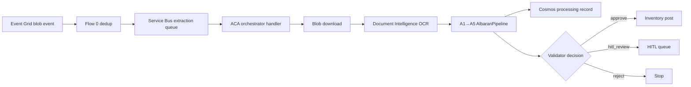

# Orchestrator ACA application specification

## Overview

The orchestrator is an Azure Container Apps-hosted FastAPI service in `src/services/orchestrator/` that owns the document-processing runtime.

## Components

- `main.py` — FastAPI app entry point and `/process` manual trigger
- `handler.py` — Service Bus queue consumer and DLQ behavior
- `orchestration.py` — blob download, OCR, pipeline execution, Cosmos persistence, HITL routing
- `health.py` — liveness and readiness endpoints
- `config.py` — environment-driven configuration for Azure dependencies

## Azure integration

All Azure access uses **`DefaultAzureCredential` only**.

Configured dependencies:

- Service Bus namespace + extraction queue
- Cosmos DB endpoint + processing database/container
- Storage account URL for blob-backed PDFs
- Azure OpenAI endpoint for agent runtime
- Document Intelligence endpoint for OCR

## Message flow

## Health checks

- `GET /health` — simple liveness response
- `GET /health/ready` — validates orchestrator configuration and Azure client construction for credential, Service Bus, Cosmos, Storage, and Document Intelligence

## Error handling + DLQ strategy

1. Queue payloads are deserialized into `OrchestrationRequest`.
2. Any processing failure updates Cosmos with `status=failed`.
3. Messages are abandoned while delivery count is below the configured retry limit.
4. Messages exceeding the retry limit are dead-lettered with an `orchestration_failed` reason.
5. `hitl_review` results are persisted as `hitl_pending` and copied to the HITL queue.

## Manual trigger path

`POST /process` accepts a blob URL plus metadata, runs the same orchestration flow, and returns the persisted orchestration result for ad hoc replay and testing.
