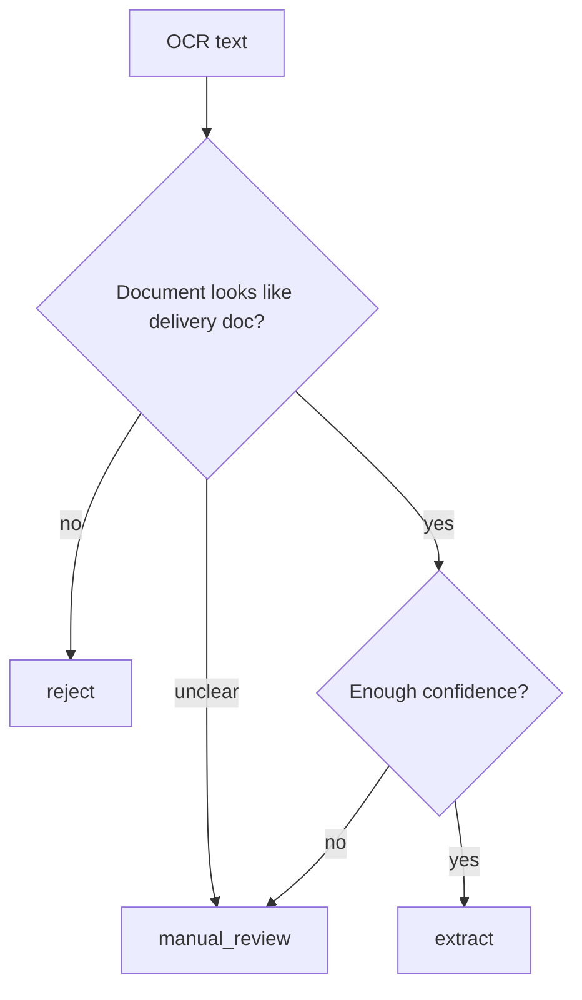

# Prompt engineering for core agents

## Scope

This document explains how the three implemented prompts work in `src/agents/prompts/` and how they are consumed by the agent builders.

## Shared prompt pattern

All three agents use the same pattern:

1. Store the base prompt as a module-level string constant.
2. Generate a live JSON schema from the corresponding Pydantic model.
3. Inject that schema into the system prompt with `.format(schema=schema)`.
4. Optionally append a human-readable MCP tool hint.

```python
schema = json.dumps(AlbaranExtraction.model_json_schema(), ensure_ascii=False, indent=2)
return EXTRACTOR_SYSTEM_PROMPT.format(schema=schema) + tool_hint
```

### Why this matters

- The prompt stays aligned with the real output model.
- Schema drift is easier to notice during code review.
- The LLM is told exactly what JSON shape to emit.

## A2 triage prompt

## Source

- `src/agents/prompts/triage_prompt.py`
- Builder: `src/agents/triage_agent.py`

## Classification strategy

The triage prompt tells the model to inspect **raw OCR text** and answer five questions implicitly:

1. Is this an `albaran`, `factura`, `packing_list`, or `unknown` document?
2. Which language is it written in?
3. Can the supplier be identified?
4. Should the document be extracted?
5. Why was that routing decision made?

### Keyword support baked into the prompt

The prompt contains concrete keyword cues:

- **Spanish:** `albarán`, `entrega`, `pedido`, `proveedor`, `cantidad`
- **Italian:** `bolla di consegna`, `fattura`, `quantità`
- **German:** `Lieferschein`, `Rechnung`, `Menge`

These are not exhaustive dictionaries; they are anchor terms to help the model classify common supplier formats.

## Language detection

The prompt explicitly asks for language detection across:

- Spanish
- Italian
- German
- English

Important nuance: the output model uses `language: str`, so the restriction is **prompt-level**, not enum-enforced.

## Routing logic

Prompt-level routes are:

- `extract`
- `reject`
- `manual_review`

The prompt also instructs the model to be conservative:

> if unsure, route to `manual_review` rather than `extract`

### Runtime consequence in `pipeline.py`

The Python pipeline only continues when:

```python
triage_result.routing_decision == "extract"
```

So, in practice:

- `extract` -> continue to A1 extractor
- any other value -> return early with triage only



## Tool usage

Triage accepts optional tools, but unlike extractor/coherence it does **not** append a default tool list into the prompt text. In the current implementation, the prompt is primarily classification-first.

## A1 extractor prompt

## Source

- `src/agents/prompts/extractor_prompt.py`
- Builder: `src/agents/extractor_agent.py`

## Extraction strategy

The extractor prompt frames the agent as a structured-data specialist over OCR output. It asks for:

- header extraction
- line-item extraction
- confidence scoring
- warning generation

### Field extraction rules encoded in the prompt

| Prompt rule | Intended result in model |
|---|---|
| "Header: supplier name, tax ID, document number, date, PO number, store, total" | `AlbaranHeader` |
| "Line items: product code, EAN, description, quantity, unit price, discount, total, lot, expiry" | `LineItem[]` |
| "Quantities must be numeric" | numeric `quantity` |
| "Prices should include currency (default EUR)" | `currency` defaults to `EUR` in header |
| "If a field is partially readable, extract what you can and lower confidence" | lower `confidence_score` + possible warnings |
| "Multi-page documents: combine data from all pages" | single `AlbaranExtraction` with `source_pages` |
| "Barcodes/EAN codes are valuable — always extract them" | populate `ean_code` whenever possible |

## Confidence scoring

The prompt asks for a confidence score between `0.0` and `1.0`. The output model enforces this with `Field(ge=0.0, le=1.0)`.

Practical interpretation:

- **High confidence**: clean OCR, clear totals, line items complete
- **Medium confidence**: partial ambiguity but usable structure
- **Low confidence**: illegible values, handwritten notes, missing tables

## Warning generation

Warnings are free-form strings in `extraction_warnings`.

Typical warning themes encouraged by the prompt:

- illegible quantities
- handwritten annotations
- missing supplier/date/PO fields
- partial totals

## Tool hinting

Extractor is the only stage that documents OCR-oriented MCP tools directly in the prompt builder.

Default names appended when no explicit tool objects are passed:

- `content_understanding.analyze_document`
- `content_understanding.extract_tables`

This gives the model extra runtime context without changing the base prompt file.

## A3 coherence prompt

## Source

- `src/agents/prompts/coherence_prompt.py`
- Builder: `src/agents/coherence_agent.py`

## Validation strategy

The coherence prompt treats the extractor output as already-structured business data and asks the model to validate it on four axes:

1. **Header coherence**
2. **Line-item coherence**
3. **Business Central cross-reference**
4. **Mathematical validation**

### Validation rules called out explicitly

| Rule family | Prompt guidance |
|---|---|
| Header coherence | dates make sense, supplier exists, PO format is valid |
| Line-item coherence | quantities > 0, prices reasonable, totals match line math |
| BC cross-reference | supplier exists, PO exists, items match |
| Mathematical validation | line totals should sum to document total within **2% tolerance** |

Important nuance: the 2% tolerance is currently a **prompt instruction**, not a hard-coded Python validator in `pipeline.py`.

## BC cross-reference behavior

The prompt says "if available", which matches the code design:

- coherence accepts optional tools
- the builder appends default Business Central search tool names
- the output model exposes `bc_match_found` and `matched_po_number`

Default tool names appended by the builder:

- `bc.search_vendors`
- `bc.search_purchase_orders`
- `bc.search_items`

## Suggested corrections

The prompt asks the model to "Suggest corrections where possible". This maps directly to:

```python
suggested_corrections: dict[str, str] = Field(default_factory=dict)
```

Typical entries could describe corrected PO numbers, supplier names, or total fields.

## Prompt versioning strategy

## Current strategy in this repo

Prompt versioning is currently **source-controlled, file-based versioning**:

- one prompt constant per file
- no runtime prompt registry
- no explicit `version` field inside prompt outputs
- changes tracked through Git history / PRs

That means the effective prompt version is the combination of:

1. prompt file content
2. Pydantic schema at that commit
3. builder logic that appends tool hints

## Practical guidance for future prompt edits

When changing a prompt, review all three layers together:

- prompt text
- output model
- builder logic

For example, adding a new field to `AlbaranExtraction` without updating examples/tests will silently change the injected schema.

## Testing prompts approach

## What is implemented today

Current automated coverage is indirect:

- `tests/unit/test_agents_pipeline.py` verifies config defaults and model round-tripping
- builder functions inject live schemas from the Pydantic models
- `_maf_compat.py` allows unit tests to run even if MAF is not installed

There is **no dedicated prompt-evaluation harness** in this branch.

## Practical testing approach for this codebase

### 1. Builder-level tests

Validate that the generated instructions contain:

- the expected schema name/fields
- the expected MCP tool hint text
- important route/validation keywords

### 2. Structured-output integration tests

Run the agents against representative OCR fixtures and assert that responses validate into:

- `TriageResult`
- `AlbaranExtraction`
- `CoherenceCheckResult`

### 3. Golden examples for supplier formats

Maintain sample albaranes for:

- Spanish suppliers
- Italian suppliers
- German suppliers
- low-quality scans
- multi-page deliveries

### 4. Regression review on prompt edits

For every prompt change, compare:

- routing changes (`extract` vs `manual_review`)
- confidence-score shifts
- new or missing warnings
- changes to `bc_match_found` / correction suggestions

## Example: schema-aware builder pattern

```python
def _build_coherence_instructions(tool_names: tuple[str, ...]) -> str:
    schema = json.dumps(CoherenceCheckResult.model_json_schema(), ensure_ascii=False, indent=2)
    tool_hint = "\nAvailable MCP tools: " + ", ".join(tool_names) if tool_names else ""
    return COHERENCE_SYSTEM_PROMPT.format(schema=schema) + tool_hint
```

This pattern is the key prompt-engineering decision in the current implementation: prompts are not static prose, they are **schema-bound system instructions**.
