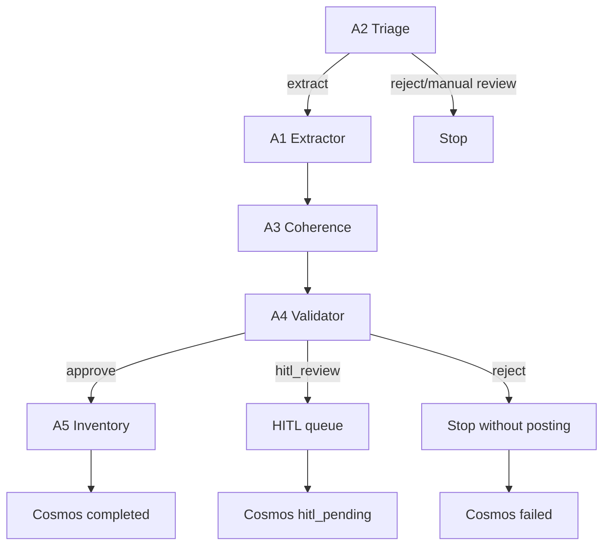

# Validation + inventory technical specification

## A4 Validator

### Purpose

The validator agent compares the structured A1/A3 extraction output against Business Central purchase order data before anything can be posted downstream.

### Model and output contract

- **Runtime agent:** `src/agents/validator_agent.py`
- **Structured output:** `src/models/validation.py::ValidationResult`
- **Default model:** `gpt-5-mini`

The validator returns:

- document-level validity (`is_valid`)
- `overall_match_pct` as a 0-1 score
- line-level comparisons and discrepancy notes
- a downstream recommendation: `approve`, `hitl_review`, or `reject`

### Tolerance rules

Numeric comparisons use a **2% tolerance** by default.

- exact matches → `match`
- inside tolerance → `tolerance`
- outside tolerance → `mismatch`
- missing counterpart values → `missing_in_bc` / `missing_in_extraction`

### Recommendation logic

- `overall_match_pct > 0.95` → `approve`
- `0.80 <= overall_match_pct <= 0.95` → `hitl_review`
- `overall_match_pct < 0.80` → `reject`

## A5 Inventory

### Purpose

The inventory agent posts approved receipts into Business Central only after A4 produces an approved validation.

### Model and output contract

- **Runtime agent:** `src/agents/inventory_agent.py`
- **Structured output:** `src/models/inventory.py::PostingResult`
- **Default model:** `gpt-5-mini`

The posting payload centers on `PurchaseReceiptPosting` and `PostingLineItem`, and the response records:

- `success`
- BC `receipt_number`
- `posted_lines`
- `bc_document_url`
- `errors`

### Business Central posting flow

1. Confirm validation is approved.
2. Map supplier, PO, posting date, and validated lines into a purchase receipt payload.
3. Create the receipt in Business Central.
4. Post confirmed lines.
5. Return the final receipt number or a failure payload.

### Error recovery

If BC posting fails after receipt creation, the agent must return a failure payload and trigger compensating action / operator follow-up rather than silently continuing.

## Full A1→A5 flow



## Handoff decision tree

```text
if triage.routing_decision != "extract":
    stop
elif validator.recommendation == "approve":
    post to inventory
elif validator.recommendation == "hitl_review":
    send to HITL queue
else:
    reject and stop
```
